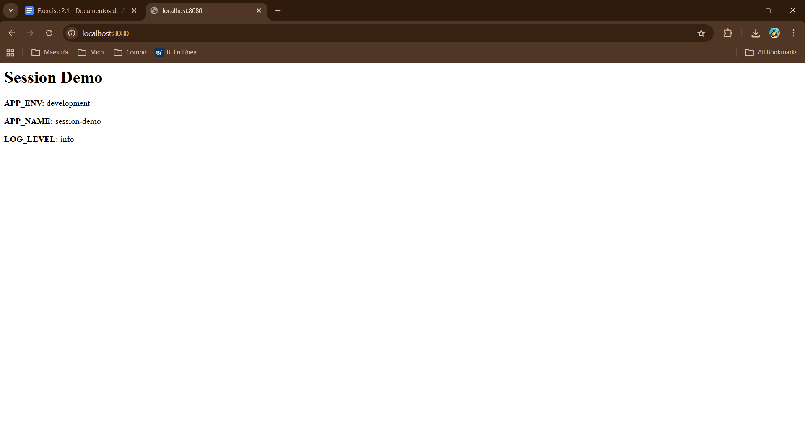

# Exercise 2.1 — Kubernetes Manifests for a Web Application

Exercise 2.1 — Kubernetes Manifests for a Web Application  
Course: Optimizaciones y Desempeño — Cloud Deployment Automation

## Overview

A containerized Node.js application deployed to a local Kubernetes cluster.
The app reads three environment variables (`APP_ENV`, `APP_NAME`, `LOG_LEVEL`)
from a ConfigMap and displays them in the browser.


## Validate and apply

```bash
kubectl apply -f k8s/ --dry-run=client
```

```
configmap/webapp-config configured (dry run)
deployment.apps/webapp configured (dry run)
namespace/webapp configured (dry run)
service/webapp-svc configured (dry run)
```

```bash
kubectl apply -f k8s/
```

```
configmap/webapp-config unchanged
deployment.apps/webapp unchanged
namespace/webapp unchanged
service/webapp-svc unchanged
```

```bash
kubectl get pods -n webapp
```

```
NAME                     READY   STATUS    RESTARTS   AGE
test-pull                1/1     Running   0          3m2s
webapp-9cc7949cd-6jspl   1/1     Running   0          42s
webapp-9cc7949cd-bdb65   1/1     Running   0          44s
```

## Evidence


